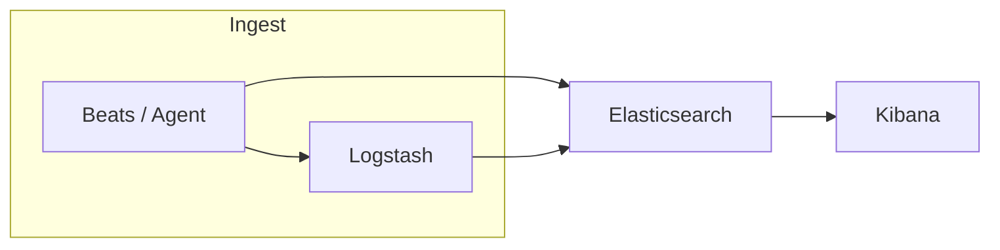

# ELK / Elastic Stack

**ELK** is the common name for a trio of open-source tools from Elastic:

- **E** — **Elasticsearch** (store, search, analyze)
- **L** — **Logstash** (collect, transform, route data)
- **K** — **Kibana** (explore, visualize, dashboards)

Elastic now markets the broader **Elastic Stack**, which adds **Beats** (lightweight data shippers) and, in newer deployments, **Elastic Agent** and **Fleet** for centralized agent management. People still say “ELK” when they mean “logs and metrics in Elasticsearch with Kibana on top,” even if Logstash is optional.

---

## What each piece does

### Elasticsearch

Distributed search and analytics engine. It indexes JSON documents, runs full-text search, filters, and aggregations, and scales across nodes. Everything in the stack ultimately lands here (or in a managed Elasticsearch service) as the **data plane**.

### Logstash

Server-side **ETL pipeline**: **inputs** (files, Beats, Kafka, HTTP, etc.), **filters** (parse grok, mutate fields, enrich), **outputs** (Elasticsearch, other systems). Use it when you need heavy parsing, enrichment, or fan-out before indexing. For simple shipping, many teams send **Beats → Elasticsearch** directly and skip Logstash.

### Kibana

Web UI for **search**, **Discover**, **dashboards**, **alerting** (with stack features), **Dev Tools** (run Elasticsearch queries), and operational views (Stack Monitoring, etc.). It talks to Elasticsearch’s APIs.

### Beats (and Elastic Agent)

**Filebeat**, **Metricbeat**, **Packetbeat**, **Auditbeat**, **Heartbeat**, etc.—small processes that tail files, scrape metrics, or watch the host, then send events to **Logstash** or **Elasticsearch**. **Elastic Agent** is the newer way to run integrations and ship data under Fleet-managed policies.

---

## Typical data flows

**Logs (classic ELK):** servers and apps → Filebeat (or Logstash input) → optional Logstash parsing → Elasticsearch → Kibana dashboards and search.

**Metrics:** Metricbeat or Agent → Elasticsearch → Kibana visualizations.

**More complex pipelines:** Kafka as a buffer → Logstash consumers → Elasticsearch; or multiple outputs from Logstash (Elasticsearch plus S3, for example).

---

## When to use Logstash vs Beats-only

- **Beats → Elasticsearch** — minimal moving parts; good for standard logs/metrics with ingest pipelines or Elasticsearch **ingest processors** doing light parsing.
- **Add Logstash** — non-trivial transforms, multiple sources merged, lookups, custom Ruby filters, or routing to many outputs.

Elasticsearch **ingest pipelines** (Painless processors, grok in ingest node) overlap with some Logstash use cases; choose based on team skills and operational complexity.

---

## Further reading

- Elastic Stack overview: [https://www.elastic.co/elastic-stack](https://www.elastic.co/elastic-stack)
- Elasticsearch reference: [https://www.elastic.co/guide/en/elasticsearch/reference/current/index.html](https://www.elastic.co/guide/en/elasticsearch/reference/current/index.html)
- Logstash: [https://www.elastic.co/guide/en/logstash/current/index.html](https://www.elastic.co/guide/en/logstash/current/index.html)
- Kibana: [https://www.elastic.co/guide/en/kibana/current/index.html](https://www.elastic.co/guide/en/kibana/current/index.html)
